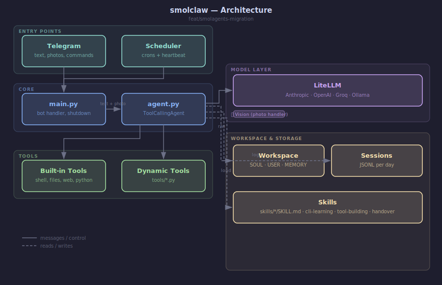

# SmolClaw

Your personal AI agent. Runs on Telegram. Self-hosted.


## Quickstart

```bash
# Install
pip install uv
uv tool install git+https://github.com/saikatkumardey/smolclaw

# Setup (2 min wizard — bot token, user ID, API key)
smolclaw setup

# Run
smolclaw start
```

That's it. Your agent is live on Telegram.

---

## Architecture



## What it does

- Remembers you across sessions (SQLite history + MEMORY.md)
- Learns your name and preferences on first boot
- Runs shell commands, reads/writes files, searches the web
- Learns any CLI tool: point it at a GitHub repo, it installs and remembers
- Builds custom skills and tools through conversation

## Learn a new CLI tool

```
You: learn to use https://github.com/saikatkumardey/teleport-scanner
Agent: clones repo → reads README → installs → writes skill → confirms
```

Next session the agent already knows how to use it.

## Build a custom skill

```
You: remember how to check my server uptime every morning
Agent: writes skills/server-uptime/SKILL.md with exact steps
```

## Build a custom tool

```
You: build me a tool that checks the weather
Agent: writes tools/get_weather.py with SCHEMA + execute()
Tool loads automatically on next message
```

## File structure

All agent data lives in `~/.smolclaw/` — separate from the installed package.

```
~/.smolclaw/
├── .env          ← your credentials (written by smolclaw setup)
├── AGENTS.md     ← standing orders and tool guidance (edit to customize behavior)
├── SOUL.md       ← agent personality (filled on first boot)
├── IDENTITY.md   ← agent name and traits
├── USER.md       ← your preferences (filled on first boot)
├── MEMORY.md     ← long-term memory (grows over time)
├── smolclaw.db   ← conversation history (SQLite)
├── skills/       ← learned behaviors (markdown)
├── tools/        ← learned tools (Python)
├── crons.yaml    ← scheduled jobs
└── mcp_servers.yaml ← MCP server connections (optional)
```

Override with `SMOLCLAW_HOME=/path/to/dir` if needed.

## Models

Supports any model via LiteLLM — Anthropic, OpenAI, Groq, Ollama, and more.
Set in `.env` as `LITELLM_MODEL=anthropic/claude-sonnet-4-6`.

## License

MIT
